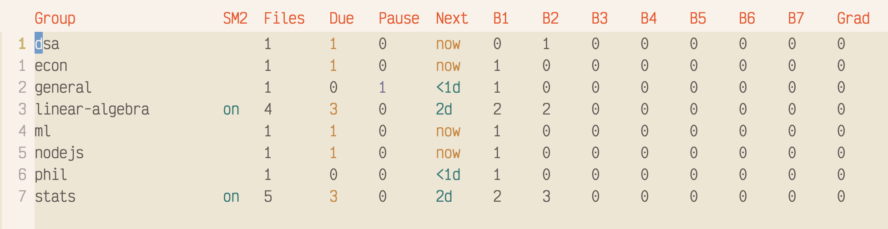

#+TITLE: leitner.el: Spaced Repetition for your org notes.
#+AUTHOR: vmargb
#+DESCRIPTION: Leitner box system for reviewing whole note files.
#+LICENSE: GPL-3.0-or-later

** What is Leitner?
=leitner.el= is an Emacs package that applies the classic =Leitner box system= to your note-taking workflow, this is for /re-reading/ your notes, not for active recall(though it can be used that way)

It is designed for people who take extensive, *long-form* notes but rarely revisit them, or find themselves overwhelmed by the volume of material to review. Rather than forgetting about your notes and letting them idle away in a folder somewhere, you simply use =leitner-add-file= which takes care of when to /resurface/ the file for your next re-reading session.

 *Leitner* does *not* /replace/ existing flashcard apps or packages, instead it complements your existing note-taking workflow by making spaced *review* a natural part of it.

** Installation with =package-vc-install= (emacs 29+)
 Add the following to your ~init.el~, you can assign your own intervals and file-path, otherwise it will use your user emacs directory:

 #+BEGIN_SRC emacs-lisp
   (use-package leitner
     :vc (:url "https://github.com/vmargb/leitner.el")
     :bind ("C-c r l" . leitner))
 #+END_SRC

*** Example Customization
 #+BEGIN_SRC emacs-lisp
 (setq leitner-index-file "~/notes/.leitner-index.json") ; change location
 (setq leitner-box-intervals [1 2 4 8 16 32]) ; set your own intervals
 (setq leitner-default-group "General") ; default when group not provided
 #+END_SRC

** Quick Start
#+ATTR_ORG: :width 600 :alt Leitner Dashboard
#+CAPTION: An example dashboard showing groups, boxes, and due files etc.

 | Keybinding                | Command               | Description                               |
 |---------------------------+-----------------------+-------------------------------------------|
 | =M-x leitner=               | =leitner=               | Open the group dashboard.                 |
 | =M-x leitner-add-group=     | =leitner-add-group=     | Add a new group.                          |
 | =M-x leitner-add-file=      | =leitner-add-file=      | Add the current buffer's file to a group. |
 | =M-x leitner-start-session= | =leitner-start-session= | Start a review session for due files.     |
 | =M-x leitner-review-graduated= | =leitner-review-graduated= | Browse graduated files; bring any back to Box 1. |
 | =M-x leitner-healthcheck=   | =leitner-healthcheck=   | Resolve deleted/renamed/moved files.      |

** How It Works
Each box has a defined review interval (Box 1 = 1 day, Box 2 = 3 days). Files are only shown for review when their interval has elapsed since the last review. Once a file reaches the final box and is rated "Good," it /graduates/ and is removed from the review queue.

Whenever a file is due, you review and rate your recall confidence:
- /Good/: The file advances up by one box level (Box 1 -> Box 2). Meaning nothing needed to be changed and you understood everything.
- /Bad/: Prompts you to either step it back one box level (made small edits) or reset it back to Box 1 (forgot important details).

- /Partial/ (new): For files too long to finish re-reading in one sitting. The box & ease factor are untouched. Instead of waiting out the full box interval, the file is marked *paused* and comes due again tomorrow so you can pick up where you left off. The =dashboard= and =group-detail= view both show a =Paused= indicator until you give them a real rating. Works well with =save-place-mode=.

- /Skip/: Leaves the file in its current box without altering its schedule.

*** Optional question prompts
Though this is built around reviewing long-form documents, you can *optionally* add specific question prompts with =#+LEITNER_PROMPT:= at the top of an org file to create standard Q&A flashcards. Otherwise it will fallback to your =#+TITLE:=. You can also leave this empty and it will just ignore the prompt entirely.

** Why Leitner and not FSRS?
On top of Leitner being much simpler to implement. Leitner's structure is transparent and you control it directly, whereas the others require trusting an algorithm's decision about when something should resurface, which is perfect for cards that are incredibly high in quantity(like vocabulary lists or definitions, concepts etc).

However, in my experience these algorithms seem to matter /less/ for simply re-reading your notes(rather than recalling them from memory) especially *longer-form* notes that you've taken in markdown or org. In this case you may want to see related material grouped together in fixed boxes with a more predictable spacing effect, that simplicity and control might actually be preferable(at least it is for me).

However, the SM-2 hybrid mode exists for this middle ground. When you have collections large enough where fixed intervals start feeling too rigid, you can toggle on sm-2, and it will adapt to your existing scheduling data from where you left off.

** SM-2 Hybrid Mode (Optional)
As your collection grows into the hundreds or thousands, you can optionally opt into *SM-2 hybrid mode*. This keeps the Leitner box structure completely intact, but gives each file a personal *ease factor* (EF) that scales its review interval:

#+BEGIN_EXAMPLE
effective interval = box interval × ease factor
#+END_EXAMPLE

*** Enabling hybrid mode

#+BEGIN_SRC emacs-lisp
(setq leitner-sm2-hybrid t)
#+END_SRC

That's it.

Enabling it midway through your workflow is safe. All files in the group start with an ease factor of =1.0=, so their intervals are completely unchanged on day one. The EF only begins drifting from actual review behaviour going forward, so that sm-2 doesn't completely take over.

*** Customization

All SM-2 hybrid parameters are individually tunable to your liking:

#+BEGIN_SRC emacs-lisp
(setq leitner-sm2-hybrid        t)    ; enable hybrid mode
(setq leitner-sm2-default-ef    1.0)  ; neutral starting EF for all items
(setq leitner-sm2-min-ef        0.5)  ; floor sits below the 1.0 baseline so Hard/Reset can shrink intervals
(setq leitner-sm2-max-ef        2.0)  ; caps a Good streak at ~2x a box's plain interval
(setq leitner-sm2-good-bonus    0.10) ; EF gain per Good rating
(setq leitner-sm2-hard-penalty  0.15) ; EF loss per Hard rating
(setq leitner-sm2-reset-penalty 0.20) ; EF loss per Reset rating (heavier than Hard)
#+END_SRC

** Changelog
- /v0.3.2:/ =Partial= rating (=C-c l p=) for notes too long to finish in one sitting, box and ease are left untouched and the file is marked =Paused=, due again the next day instead of waiting out the full interval. This pairs well with =save-place-mode= to resume mid-file.
- /v0.3.1:/ Graduated-file browser (=leitner-review-graduated=, =G= on the dashboard) to bring individual files back to Box 1 if they become important again. SM-2 floor/ceiling are now =0.5= / =2.0=, centered around the 1.0 baseline.
- /v0.3.0:/ sm-2 implementation through =leitner-sm2-hybrid=. Applies an ease factor to each box + item.
- /v0.2.3:/ Batch-add multiple files to group through dired mode + automation hooks for extensibility
- /v0.2.2:/ Rename groups + Healthcheck to resolve rename/delete/moved files in a group
- /v0.2.1:/ Random box shuffling & optional question prompts for review
- /v0.2.0:/ Complete Leitner box system implementation with dashboard + algorithm and scheduling metadata.
